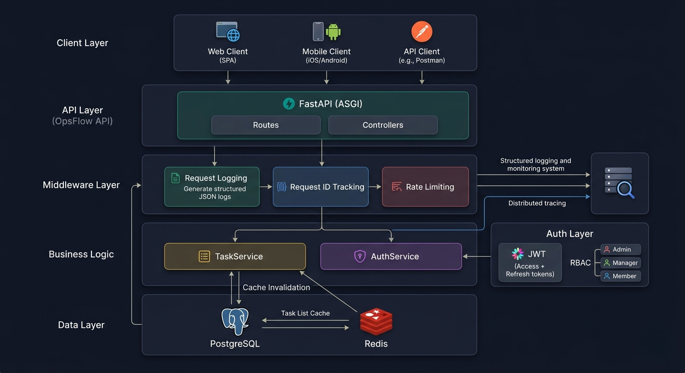
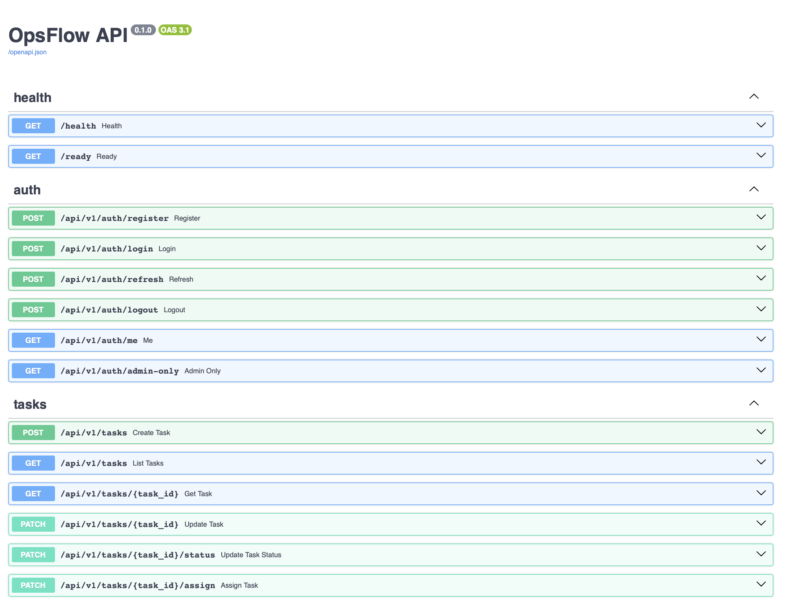

# Scalable Backend System (OpsFlow API)


Production-ready FastAPI backend for a task and operations management platform.

This project demonstrates real-world backend architecture, including authentication, role-based access control, caching, rate limiting, and observability.

---

## Overview

OpsFlow API is a backend system designed for managing tasks within teams and organizations.

It includes:
- JWT authentication (access + refresh tokens)
- Role-based permissions (admin / manager / member)
- Task management system
- Redis caching layer
- Rate limiting
- Structured logging with request IDs
- Dockerized environment

---

## Architecture



System architecture illustrating API layer, service layer, caching, and database interactions.

---

## Tech Stack

- **FastAPI**
- **PostgreSQL**
- **Redis**
- **SQLAlchemy 2.0**
- **Pydantic v2**
- **Docker / Docker Compose**
- **JWT (python-jose)**
- **Passlib (bcrypt)**
- **Structlog (logging)**
- **SlowAPI (rate limiting)**

---

## Authentication

- Register / Login
- Access & Refresh tokens
- Token invalidation via `token_version`
- Role-based access control

### Roles
- `admin`
- `manager`
- `member`

---

## Features

### Tasks
- Create task
- Update task
- Assign user
- Change status (`todo`, `in_progress`, `done`)
- Filters:
  - by status
  - by owner
  - by assignee
  - mine=true
- Pagination

### Performance
- Redis caching for task lists
- Cache invalidation after updates

### Security
- JWT authentication
- Role-based permissions
- Rate limiting on login endpoint

### Observability
- Structured JSON logs
- Request ID per request
- Request duration tracking

---

## Testing

The project includes an async test suite using **pytest + httpx**.

Coverage includes:
- authentication flow
- protected routes
- task creation & updates
- status transitions

Run tests:

```bash
docker compose exec app pytest -v
```

---

## API Endpoints

### Auth
- `POST /api/v1/auth/register`
- `POST /api/v1/auth/login`
- `POST /api/v1/auth/refresh`
- `POST /api/v1/auth/logout`
- `GET /api/v1/auth/me`

### Tasks
- `POST /api/v1/tasks`
- `GET /api/v1/tasks`
- `GET /api/v1/tasks/{id}`
- `PATCH /api/v1/tasks/{id}`
- `PATCH /api/v1/tasks/{id}/status`
- `PATCH /api/v1/tasks/{id}/assign`

### Health
- `GET /health`

---

## API Preview



Interactive API documentation powered by FastAPI (OpenAPI).

---

## Run Locally

```bash
git clone https://github.com/vlimkv/scalable-backend-system.git
cd scalable-backend-system
cp .env.example .env
docker compose up --build
```

API:
http://localhost:8000

Docs:
http://localhost:8000/docs

---

## Example Flow

1. Register user
2. Login → get tokens
3. Create task
4. Assign task
5. Update status
6. Fetch tasks with filters

---

## Project Structure
```bash
app/
├── api/           # Routes
├── core/          # Config, logging, security
├── models/        # DB models
├── schemas/       # Pydantic schemas
├── services/      # Business logic
├── utils/         # Helpers (pagination, request id)
```

---

## Production Engineering Concepts

This project demonstrates real-world backend engineering practices:

- Layered architecture (API → Service → Data)
- JWT authentication with refresh tokens
- Role-based access control (RBAC)
- Redis caching with invalidation strategy
- Rate limiting for API protection
- Structured logging with request tracing
- Async-first design (FastAPI + SQLAlchemy 2.0)
- Dockerized development environment
- Automated testing (pytest)

Designed to reflect patterns used in real production systems rather than simple CRUD applications.